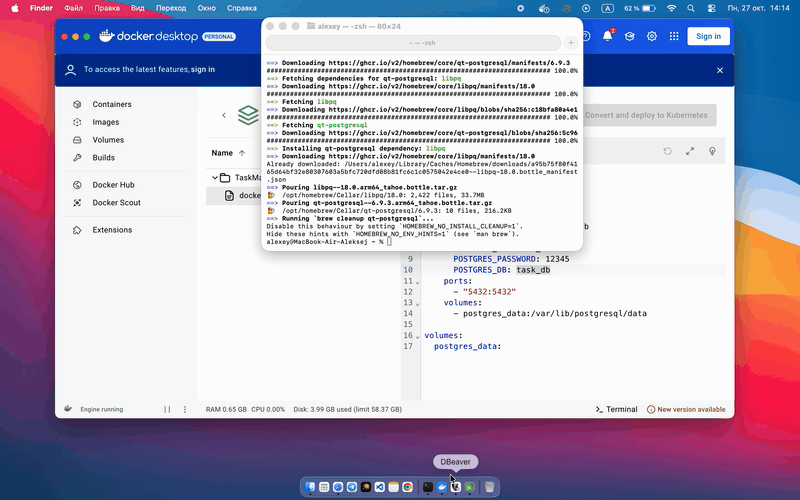

# TaskManager

TaskManager — это корпоративное приложение для управления задачами с авторизацией пользователей. Глава организации или его заместители заходят в приложение под администраторами и отправляют задания подчинённым, у которых оно появляется в приложении; далее администрация следит за количеством заданий и их статусами.

## Демонстрация

## Возможности  
- Авторизация и регистрация пользователей  
- Создание, редактирование и удаление задач со стороны администрации 
- Администратор может управлять всеми задачами  
- Подключение к базе данных PostgreSQL
- Интерфейс на Qt6 с TableView для отображения задач
- Безопасное хранение паролей: PBKDF2-HMAC-SHA256 с солью

## Используемые технологии

Язык программирования: C++

Фреймворк: Qt6 (Widgets, SQL, Core)

База данных: PostgreSQL

Система управления версиями: Git

Контейнеризация: Docker

Криптография: OpenSSL (для хеширования паролей)

## Настройки базы данных 

CREATE TABLE public.tasks (

	id serial4 NOT NULL,
 
	user_id int4 NULL,
 
	description varchar(30) NULL,
 
	complete bool DEFAULT false NULL,
 
	CONSTRAINT tasks_pkey PRIMARY KEY (id),
 
	CONSTRAINT tasks_user_id_fkey FOREIGN KEY (user_id) REFERENCES public.users(id) ON DELETE CASCADE
 
);

CREATE TABLE public.users (

	id serial4 NOT NULL,
 
	"name" varchar(30) NULL,
 
	"admin" bool NULL,
 
	hash_password text NULL,
 
	salt text NULL,
 
	CONSTRAINT users_pkey PRIMARY KEY (id)
 
);

## Запуск базы данных через Docker

В репозитории есть `docker-compose.yaml`, который поднимает PostgreSQL 16. Пароль в файле не
хранится — он берётся из `.env`, который docker compose читает сам.

1. Создайте `.env` из примера и укажите свой пароль:

	cp .env.example .env

2. Поднимите базу:

	docker compose up -d

3. Создайте таблицы из раздела «Настройки базы данных» — например, так:

	docker compose exec db psql -U db_user -d task_db

Если вы меняли `DB_USER` или `DB_NAME` в `.env`, подставьте свои значения.

Остановить базу: `docker compose down`. Данные остаются в томе `postgres_data`;
чтобы удалить и их — `docker compose down -v`.

Файл `.env` в git не попадает (он в `.gitignore`), в репозитории лежит только `.env.example`
с условными значениями.

## Переменные окружения

Приложение не хранит параметры подключения в коде и читает их из окружения:

| Переменная | Назначение | По умолчанию |
|---|---|---|
| `DB_HOST` | адрес сервера БД | `localhost` |
| `DB_PORT` | порт | `5432` |
| `DB_NAME` | имя базы | `task_db` |
| `DB_USER` | пользователь | `db_user` |
| `DB_PASSWORD` | пароль | **обязателен** |

`DB_PASSWORD` значения по умолчанию не имеет: если переменная не задана, приложение покажет
сообщение об ошибке и к базе не подключится.

### В терминале

	export DB_PASSWORD=ваш_пароль
	./TaskManager

Или одной строкой, не оставляя пароль в окружении:

	DB_PASSWORD=ваш_пароль ./TaskManager

### В Qt Creator

Projects → Run → Environment → Add: имя `DB_PASSWORD`, значение — ваш пароль.
Там же при необходимости добавляются `DB_HOST`, `DB_PORT`, `DB_NAME`, `DB_USER`.
Значения переменных сохраняются в `CMakeLists.txt.user`, который в git не попадает.

## Установка и запуск  

1. Установите зависимости:  
   - Qt6  
   - PostgreSQL  
   - CMake  
   - OpenSSL
   - Docker (если поднимаете базу через docker compose)

   Qt должен быть с драйвером `QPSQL` — это отдельный плагин для PostgreSQL.
   Если при запуске в консоль выводится
   `QSqlDatabase: can not load requested driver 'QPSQL', available drivers: QSQLITE`,
   значит плагина нет: возьмите Qt из официального установщика
   (в сборке из Homebrew драйвера PostgreSQL нет).

2. Склонируйте репозиторий:  
	
 git clone https://github.com/triplq/TaskManager.git
	
 cd TaskManager

3. Соберите и запустите проект
	
 mkdir build && cd build
	
 cmake ..
	
 make

Перед запуском поднимите базу и задайте переменные окружения — см. разделы выше.

> **Важно про старые базы.** Формат хранения паролей изменился: раньше это был один проход
> SHA-256, теперь PBKDF2-HMAC-SHA256. Пользователи, заведённые в старом формате, войти
> не смогут. Совместимость не предусмотрена, поэтому старую базу нужно удалить или пересоздать
> (`docker compose down -v`, затем `docker compose up -d` и заново создать таблицы)
> и зарегистрировать пользователей снова.

## Ограничения

Клиент подключается к PostgreSQL напрямую, своего сервера между ними нет. Отсюда следствия:

- роль пользователя (`admin`) проверяется только на стороне клиента, поэтому разграничение прав
  в текущем виде — это удобство интерфейса, а не защита;
- каждому клиенту нужны реквизиты доступа к базе, а значит, права в самой БД — это единственное
  место, где ограничения действительно соблюдаются;
- в реальной системе между клиентом и базой должен стоять сервер (REST/gRPC), который проверяет
  права, валидирует запросы и один владеет доступом к БД.
